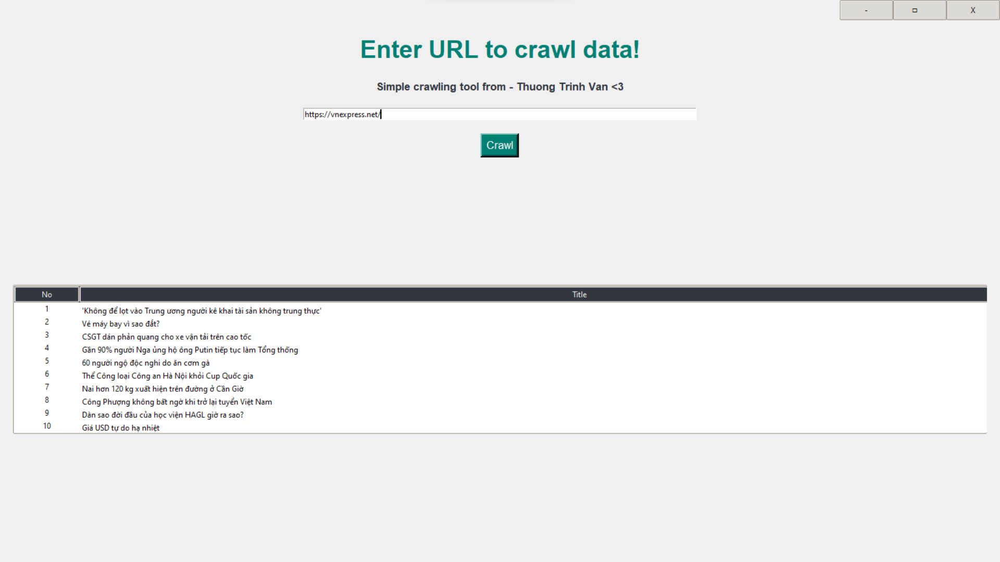
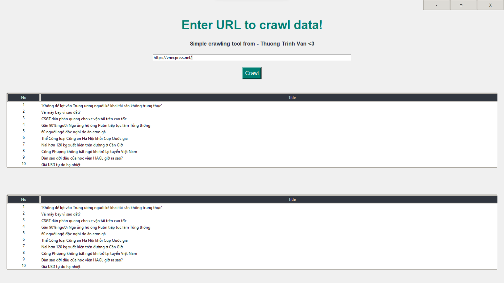

# Description
A simple web crawling tool in Python can be created using the requests library for making HTTP requests and BeautifulSoup for parsing HTML content. The tool typically takes a URL and a table ID as input parameters, retrieves the HTML content from the specified webpage, and then extracts data from the table with the provided ID. This involves sending an HTTP request to the URL, parsing the HTML content using BeautifulSoup, locating the target table by its ID, and extracting the content from the table rows and cells. The extracted data is then returned as a list, where each element corresponds to a row in the table, and the contents of each row are represented as a list of cell values. It's important to note that web scraping should be done responsibly and in compliance with the website's terms of service, and consideration should be given to potential access restrictions and ethical considerations. </br>

# Author
Thuong Trinh Van </br>

# Installation

1. Create virtualenv:

   ```bash
   python -m venv venv

2. Activate venv:

   ```bash
   venv/Scripts/activate   

3. Install packages:

   ```bash
   python -r install requirements.txt

4. Run application:

   ```bash
   python App.py

5. Enter URL, ex: https://vnexpress.net/

6. Press **'Crawl'** button

# Demo picture


